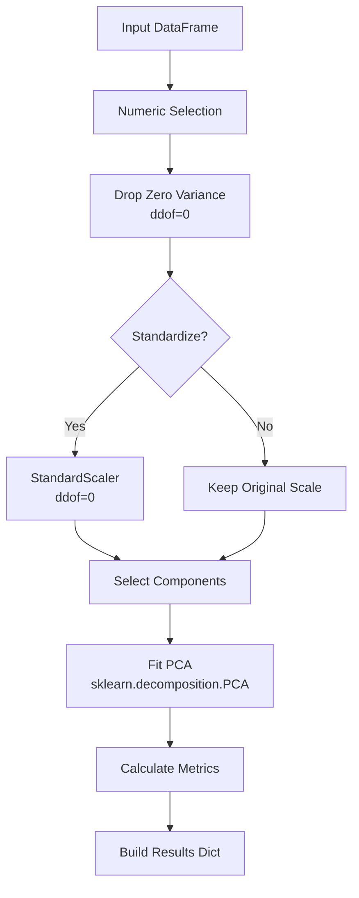

# Principal Component Analysis (PCA) Documentation

## Table of Contents
1. [Overview](#overview)
2. [Mathematical Foundation](#mathematical-foundation)
3. [Implementation Pipeline](#implementation-pipeline)
4. [API Reference](#api-reference)
5. [Mathematical Properties](#mathematical-properties)
6. [Usage Examples](#usage-examples)
7. [References](#references)

---

## Overview

This document describes the PCA implementation in `sleap_roots_analyze.pca`, detailing the mathematical foundation, implementation choices, and connections to scikit-learn.

### Key Features
- Automatic component selection based on explained variance threshold
- Per-feature variance decomposition
- Mahalanobis distance calculation for outlier detection
- Consistent handling of degrees of freedom (ddof)
- Integration with scikit-learn's PCA and StandardScaler

---

## Mathematical Foundation

### Notation

| Symbol | Description | Dimension |
|--------|-------------|-----------|
| $X$ | Input data matrix | $n \times p$ |
| $X_{\text{proc}}$ | Processed data (after standardization/filtering) | $n \times p'$ |
| $n$ | Number of samples | scalar |
| $p$ | Original number of features | scalar |
| $p'$ | Number of features after filtering | scalar |
| $U, S, V^T$ | SVD decomposition of $X_{\text{proc}}$ | - |
| $\lambda_k$ | $k$-th eigenvalue | scalar |
| $v_k$ | $k$-th eigenvector | $p' \times 1$ |
| $m^*$ | Number of retained components | scalar |
| $V_m$ | Matrix of retained eigenvectors | $p' \times m^*$ |
| $T$ | Scores (transformed data) | $n \times m^*$ |

### Core Decomposition

The PCA is based on the eigendecomposition of the sample covariance matrix:

$$\Sigma = \frac{1}{n-1} X_{\text{proc}}^T X_{\text{proc}} = V \Lambda V^T$$

where:
- $\Lambda = \text{diag}(\lambda_1, \ldots, \lambda_{p'})$ with $\lambda_1 \geq \lambda_2 \geq \ldots \geq \lambda_{p'} \geq 0$
- $V = [v_1 | v_2 | \ldots | v_{p'}]$ are orthonormal eigenvectors

---

## Implementation Pipeline



---

## API Reference

### Main Entry Point

#### `perform_pca_analysis()`
**Location:** `sleap_roots_analyze.pca`

```python
def perform_pca_analysis(
    data: Union[pd.DataFrame, np.ndarray],
    standardize: bool = True,
    explained_variance_threshold: float = 0.95,
    n_components: Optional[int] = None,
    random_state: int = 42
) -> Dict
```

Complete PCA pipeline with automatic component selection.

**Uses scikit-learn:**
- [`sklearn.preprocessing.StandardScaler`](https://scikit-learn.org/stable/modules/generated/sklearn.preprocessing.StandardScaler.html) for standardization
- [`sklearn.decomposition.PCA`](https://scikit-learn.org/stable/modules/generated/sklearn.decomposition.PCA.html) for decomposition

### Data Preprocessing

#### `standardize_data()`
**Location:** `sleap_roots_analyze.pca`

```python
def standardize_data(df: pd.DataFrame) -> Tuple[np.ndarray, StandardScaler, pd.DataFrame]
```

Preprocesses data by:
1. Selecting only numeric columns
2. **Always dropping zero-variance columns** (using population variance, ddof=0)
3. If standardizing, scales to unit variance using **population variance** (ddof=0):

$$z_{ij} = \frac{x_{ij} - \mu_j}{\sigma_j}$$

where $\sigma_j = \sqrt{\frac{1}{n}\sum_i (x_{ij} - \mu_j)^2}$

**Note:** Zero-variance removal occurs regardless of standardization choice. Uses `StandardScaler` with default `ddof=0`, resulting in unit population variance.

### Component Selection

#### `select_n_components()`
**Location:** `sleap_roots_analyze.pca`

```python
def select_n_components(
    X: np.ndarray,
    explained_variance_threshold: float,
    n_components: Optional[int],
    random_state: int
) -> int
```

Selects the minimum number of components to exceed the variance threshold:

$$m^* = \min\{m : \sum_{k=1}^m \text{EVR}_k \geq \tau\}$$

where $\tau$ is the `explained_variance_threshold`.

### Metrics Calculation

#### `calculate_pca_metrics()`
**Location:** `sleap_roots_analyze.pca`

```python
def calculate_pca_metrics(
    pca: PCA,
    X_transformed: np.ndarray,
    X_fitted: Optional[np.ndarray] = None,
    ddof_for_feature_var: int = 1,
) -> Dict
```

Computes comprehensive PCA metrics including per-feature variance decomposition.

**Key Calculations:**

1. **Per-feature variance explained** (diagonal of rank-$m^*$ covariance approximation):

$$\boxed{\text{VarExplained}_j = \sum_{k=1}^{m^*} v_{jk}^2 \cdot \lambda_k}$$

2. **Per-feature fraction explained**:

$$\boxed{\text{FracExplained}_j = \frac{\text{VarExplained}_j}{\text{Var}_{\text{ddof}}(X_{\cdot j})}}$$

3. **Total fraction explained** (consistent form):

$$\boxed{\text{TotalFracExplained} = \frac{\sum_{k=1}^{m^*} \lambda_k}{\sum_{j=1}^{p'} \text{Var}_{\text{ddof}}(X_{\cdot j})}}$$

### Feature Metrics DataFrame

#### `build_feature_metrics_df()`
**Location:** `sleap_roots_analyze.pca`

```python
def build_feature_metrics_df(
    pca_result: Dict,
    ddof_feature_var: Optional[int] = None,
    include_loadings: bool = True,
    loading_prefix: str = "loading_pc",
    sort_by: str = "fraction_explained",
) -> pd.DataFrame
```

Creates a tidy DataFrame with per-feature statistics, optionally including loadings.

### Outlier Detection

#### `calculate_mahalanobis_distances()`
**Location:** `sleap_roots_analyze.pca`

```python
def calculate_mahalanobis_distances(
    X_transformed: np.ndarray,
    robust: bool = True
) -> Tuple[np.ndarray, np.ndarray, np.ndarray]
```

Computes Mahalanobis distances in PC space:

$$D_i = \sqrt{(T_i - \mu_T)^T \Sigma_T^{-1} (T_i - \mu_T)}$$

**Uses scikit-learn:**
- [`sklearn.covariance.MinCovDet`](https://scikit-learn.org/stable/modules/generated/sklearn.covariance.MinCovDet.html) for robust covariance estimation when `robust=True`

---

## Mathematical Properties

Our implementation ensures these mathematical properties hold:

### 1. Orthonormality of Loadings
$$V_m^T V_m = I_{m^*}$$

**Test:** `test_orthonormal_loadings()` in `tests/test_pca.py`

### 2. Trace Preservation
$$\sum_{j=1}^{p'} \text{VarExplained}_j = \sum_{k=1}^{m^*} \lambda_k$$

**Test:** `test_trace_preservation()` in `tests/test_pca.py`

### 3. Variance Bounds
$$0 \leq \text{FracExplained}_j \leq 1 \quad \forall j$$

**Test:** `test_per_feature_bounds()` in `tests/test_pca.py`

### 4. Total Variance Accounting
With all components and ddof=1:
$$\sum_{j=1}^{p'} \text{FracExplained}_j = p'$$

**Test:** `test_total_variance_accounting()` in `tests/test_pca.py`

### 5. Reconstruction Error Monotonicity
$$\|X - \hat{X}_m\|_F^2 \geq \|X - \hat{X}_{m+1}\|_F^2$$

**Test:** `test_reconstruction_error_monotonicity()` in `tests/test_pca.py`

---

## Usage Examples

### Basic PCA Analysis

```python
from sleap_roots_analyze.pca import perform_pca_analysis

# Load your data
df = pd.read_csv("root_traits.csv")

# Perform PCA with standardization
result = perform_pca_analysis(
    df,
    standardize=True,
    explained_variance_threshold=0.95
)

# Access results
print(f"Components selected: {result['n_components_selected']}")
print(f"Variance explained: {result['cumulative_variance_ratio'][-1]:.2%}")
```

### Per-Feature Analysis

```python
from sleap_roots_analyze.pca import build_feature_metrics_df

# Build feature metrics DataFrame
feature_df = build_feature_metrics_df(
    result,
    include_loadings=True,
    sort_by="fraction_explained"
)

# Identify top contributing features
top_features = feature_df.head(10)["feature"].tolist()
print(f"Top 10 features: {top_features}")
```

### Outlier Detection

```python
from sleap_roots_analyze.pca import calculate_mahalanobis_distances
import numpy as np

# Calculate Mahalanobis distances
distances, mean, cov = calculate_mahalanobis_distances(
    result["transformed_data"],
    robust=True
)

# Identify outliers (e.g., >95th percentile)
threshold = np.percentile(distances, 95)
outliers = distances > threshold
print(f"Found {outliers.sum()} outliers")
```

### Integration with Heritability Analysis

```python
from sleap_roots_analyze.statistics import calculate_heritability_estimates

# Filter low-variance features first
pca_result = perform_pca_analysis(df, standardize=True)
high_var_features = pca_result["feature_names"]

# Calculate heritability on selected features
h2_results = calculate_heritability_estimates(
    df[high_var_features + ["geno", "rep"]],
    trait_cols=high_var_features
)
```

---

## Degrees of Freedom (ddof) Considerations

### The Issue
- **StandardScaler** uses population variance (ddof=0): $\sigma^2 = \frac{1}{n}\sum(x_i - \bar{x})^2$
- **PCA eigenvalues** use sample variance (ddof=1): $s^2 = \frac{1}{n-1}\sum(x_i - \bar{x})^2$

### Our Solution
The `calculate_pca_metrics()` function accepts `ddof_for_feature_var` parameter:
- **ddof=1** (default): Consistent with PCA eigenvalues, ensures fractions sum to 1 with all components
- **ddof=0**: Consistent with StandardScaler, but fractions may sum to $\frac{n}{n-1} > 1$

### Recommendation
Use `ddof=1` (default) for mathematical consistency unless you specifically need population variance.

---

## Test Suite

Our comprehensive test suite (`tests/test_pca.py`) includes:

- **88 total tests** covering all PCA functionality
- **Mathematical validation tests** in `TestPCAMathematicalValidation` class
- **Per-feature variance tests** in `TestPerFeatureVariance` class
- **Edge case handling** for single samples, constant features, etc.
- **Integration tests** with real root trait data

Run tests:
```bash
uv run pytest tests/test_pca.py -v
```

---

## References

### Scikit-learn Documentation
- [PCA User Guide](https://scikit-learn.org/stable/modules/decomposition.html#pca)
- [StandardScaler Documentation](https://scikit-learn.org/stable/modules/generated/sklearn.preprocessing.StandardScaler.html)
- [MinCovDet for Robust Covariance](https://scikit-learn.org/stable/modules/covariance.html#robust-covariance)

### Mathematical Background
- Jolliffe, I.T. (2002). *Principal Component Analysis*. Springer Series in Statistics.
- Hotelling, H. (1933). "Analysis of a complex of statistical variables into principal components". *Journal of Educational Psychology*.

### Related Functions in Our Codebase
- `sleap_roots_analyze.data_cleanup.get_trait_columns()` - Identifies numeric trait columns
- `sleap_roots_analyze.statistics.calculate_heritability_estimates()` - Can use PCA-filtered features
- `sleap_roots_analyze.data_cleanup.remove_low_variance_traits()` - Alternative variance filtering

---

## Appendix: Implementation Details

### Why We Don't Use `sklearn.preprocessing.scale()`
We use `StandardScaler` instead of `scale()` because:
1. We need to store the scaler for inverse transformation
2. Better integration with pipelines
3. Clearer parameter control

### Handling Missing Data
The pipeline automatically removes rows with NaN values before PCA:
```python
df_clean = df.dropna()
```
For more sophisticated imputation, preprocess your data before calling `perform_pca_analysis()`.

### Memory Efficiency
For large datasets, consider:
- Using `n_components` parameter to limit components upfront
- Processing in batches if needed
- Using `svd_solver='randomized'` in sklearn (not currently exposed)